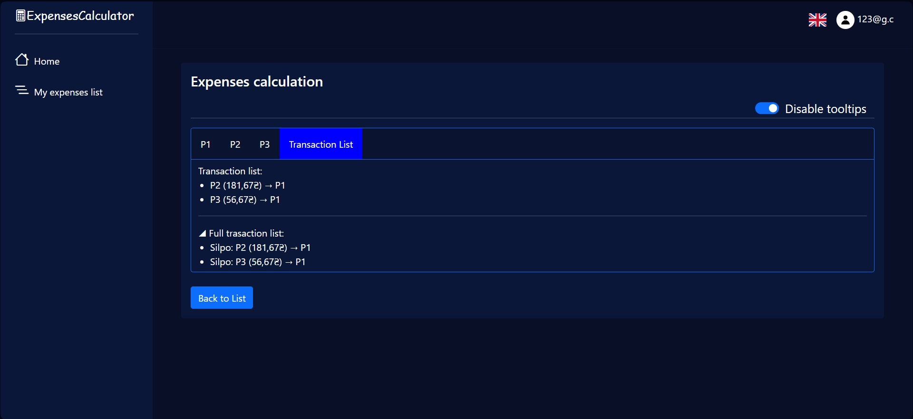
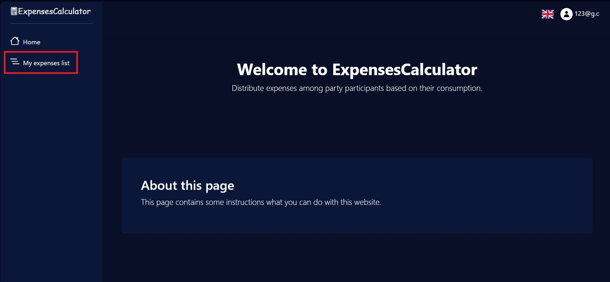
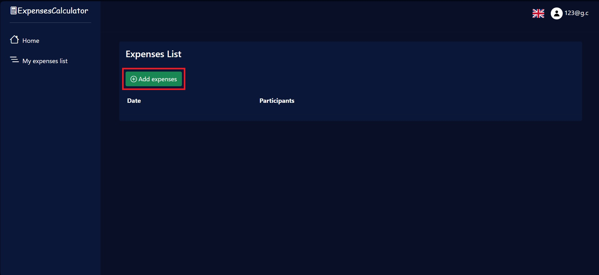
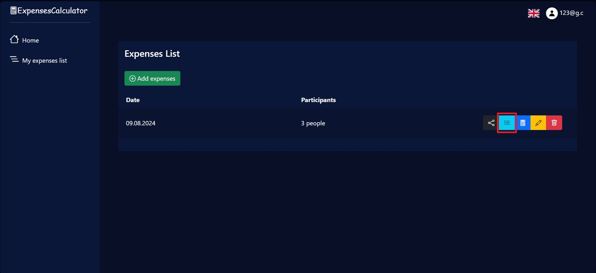
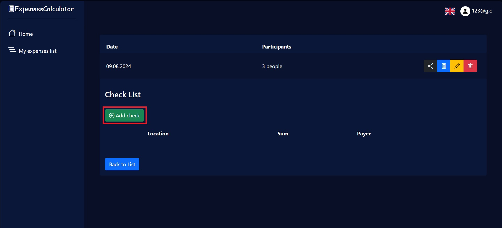
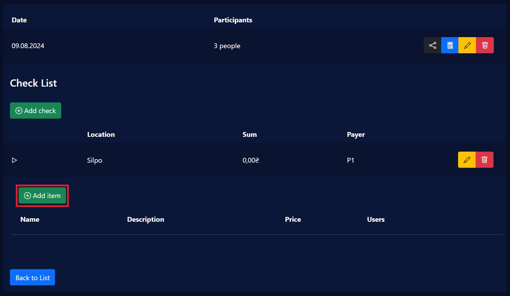
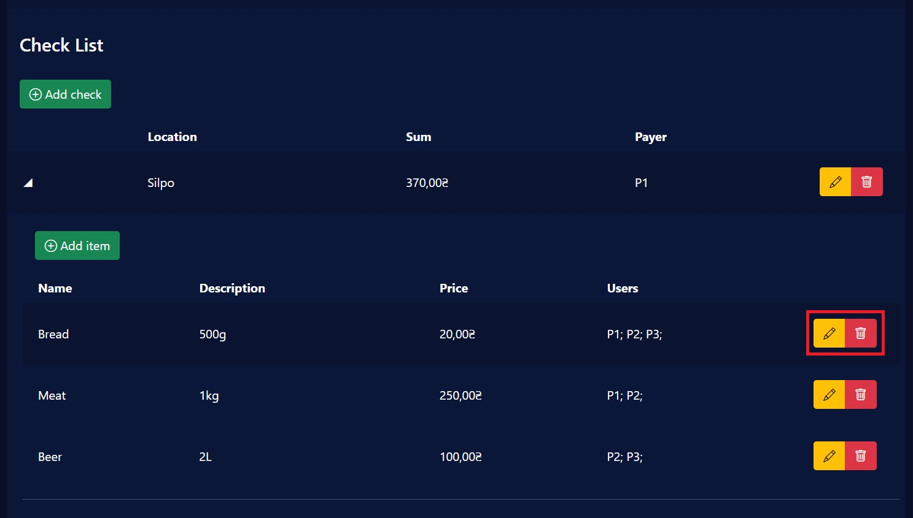
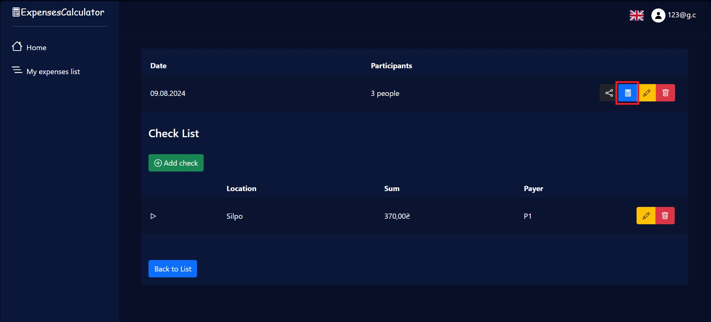
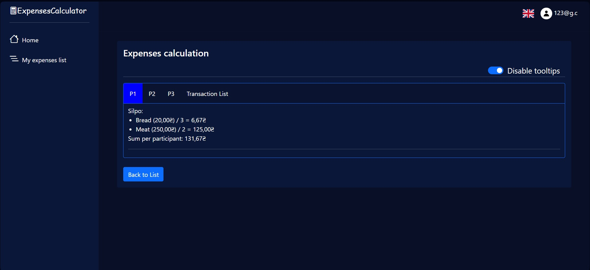
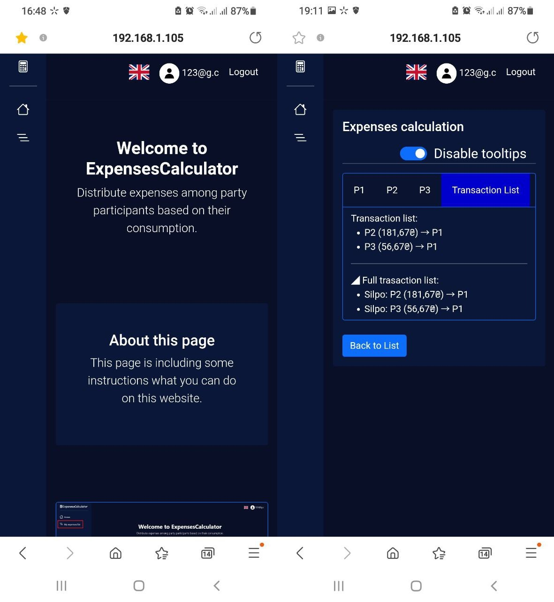

# ExpensesCalculator

## About the project
#### Distribute expenses among party participants based on their consumption.

## Usage
### Select the "My expenses list" tab

### Click the "Add expenses" button and enter the required data

### Click the button with a list image, to enter data about the items to be calculated

### On the next screen, add checks, which are used to group items by who paid for them

### Open the appropriate check and add the items of this check

### Use the edit and delete buttons to change data if it was entered incorrectly

### Click the button with a calculator image, to calculate the expenses between the participants

### Switch between tabs to see how much every participant spent on the party

### On the "Transaction list" tab you can see how much money each participant owes to the people who paid for the party

## Mobile support
The ExpensesCalculator is compatible with devices of all sizes and all OS's, and consistent improvements are being made.

## Demo
* https://expensescalculator.azurewebsites.net

## Built with 
* [![Dotnet][Dotnet.com]][Dotnet-url]
* [![Blazor][Blazor.com]][Blazor-url]
* [![Bootstrap][Bootstrap.com]][Bootstrap-url]
* [![JQuery][JQuery.com]][JQuery-url]

## Roadmap
- [x] Add a manager for adding, editing, deleting items
- [x] Add an expenses calculator
- [x] Add instructions for using the website
- [ ] Add a preview of the check photo
- [ ] Add an email confirmation
- [ ] Add two-factor authentication
- [ ] Improve the user data access model
- [ ] Add expenses statistics (average number of participants, money spent by party, money spent per month, etc.)
- [ ] Multi-language support
    - [ ] Ukrainian

<!-- MARKDOWN LINKS & IMAGES -->
[Dotnet.com]: https://img.shields.io/badge/.NET-512BD4?style=for-the-badge&logo=dotnet&logoColor=white
[Dotnet-url]: https://dotnet.microsoft.com
[Blazor.com]: https://img.shields.io/badge/Blazor-512BD4?style=for-the-badge&logo=blazor&logoColor=white
[Blazor-url]: https://dotnet.microsoft.com/en-us/apps/aspnet/web-apps/blazor
[Bootstrap.com]: https://img.shields.io/badge/Bootstrap-563D7C?style=for-the-badge&logo=bootstrap&logoColor=white
[Bootstrap-url]: https://getbootstrap.com
[JQuery.com]: https://img.shields.io/badge/jQuery-0769AD?style=for-the-badge&logo=jquery&logoColor=white
[JQuery-url]: https://jquery.com 
