# ExpensesCalculator

## Table of Contents
- [About the Project](#about-the-project)
- [Key Features](#key-features)
- [Demo](#demo)
- [Screenshots](#screenshots)
- [Usage](#usage)
- [Built With](#built-with)
- [Roadmap](#roadmap)

## About the project
ExpensesCalculator is a web application designed to simplify group expense management. Whether you're splitting a restaurant bill, tracking vacation expenses, or managing roommate costs, this tool helps you fairly distribute expenses among party participants based on their actual consumption.

**Perfect for:**
- Restaurant bills with friends
- Group vacations and trips
- Shared living expenses (roommates)
- Team lunches and events
- Road trips with multiple drivers
- Any situation where costs need to be split fairly

The application goes beyond simple split-the-bill calculators by allowing you to track individual items, organize them by who paid, and automatically calculate who owes whom - making expense settlements clear and fair.

## Key Features

- **Smart Expense Splitting** - Distribute costs based on individual consumption, not just equal splits
- **Group Tracking** - Manage expenses with multiple participants and track who paid for what
- **Item-Level Granularity** - Break down expenses into individual items organized by checks
- **Automatic Calculations** - Calculate who owes whom with minimal transactions
- **Expense Statistics** - View analytics including average participants, total spending, and monthly trends
- **Multi-Language Support** - Available in English and Ukrainian
- **Mobile Responsive** - Works seamlessly on all devices and screen sizes
- **Smart Tags** - Organize and categorize expenses for better tracking
- **Item Discovery** - Get smart recommendations based on your expense history

## Demo
Try it live: https://expensescalculator.azurewebsites.net

## Screenshots

### Landing Page
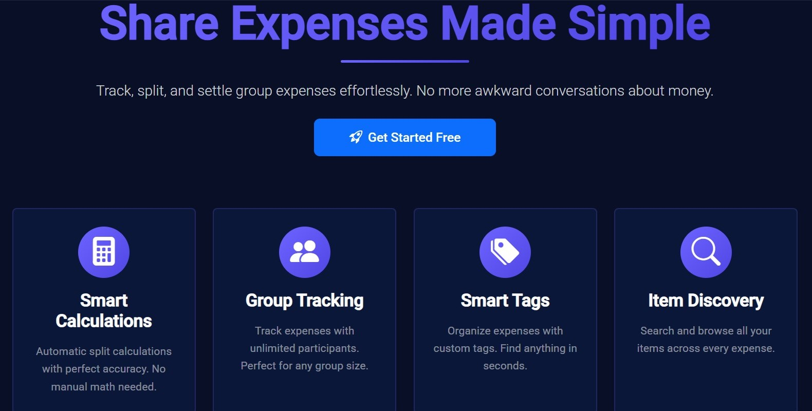
*Welcome page showcasing key features*

### Expense Management
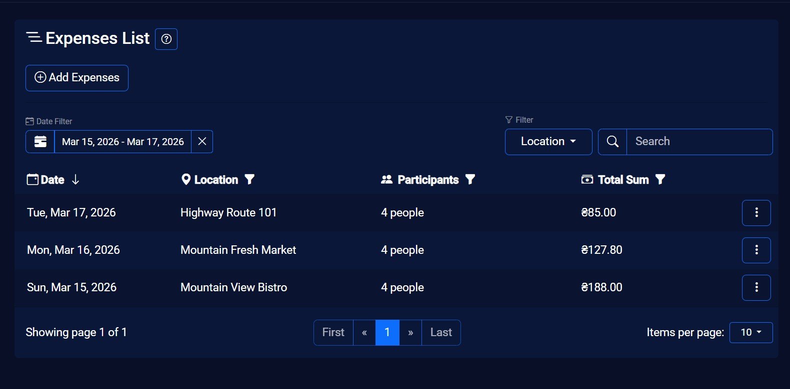
*Main expenses list view with search and filters*

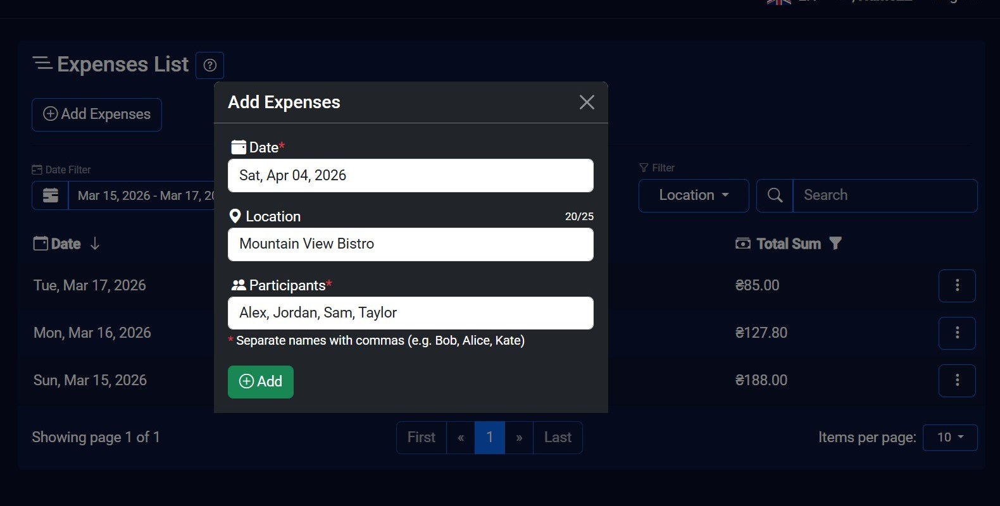
*Creating a new expense with participants*

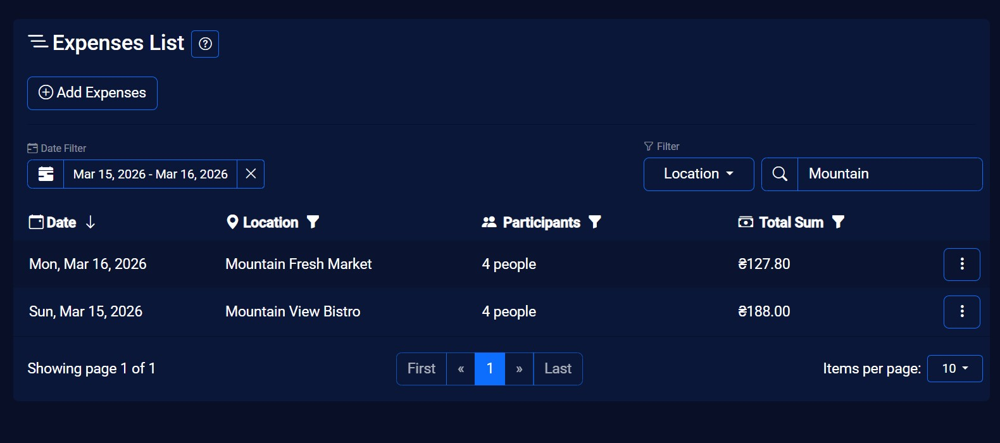
*Filtering expenses by date range and location*

### Check & Item Management
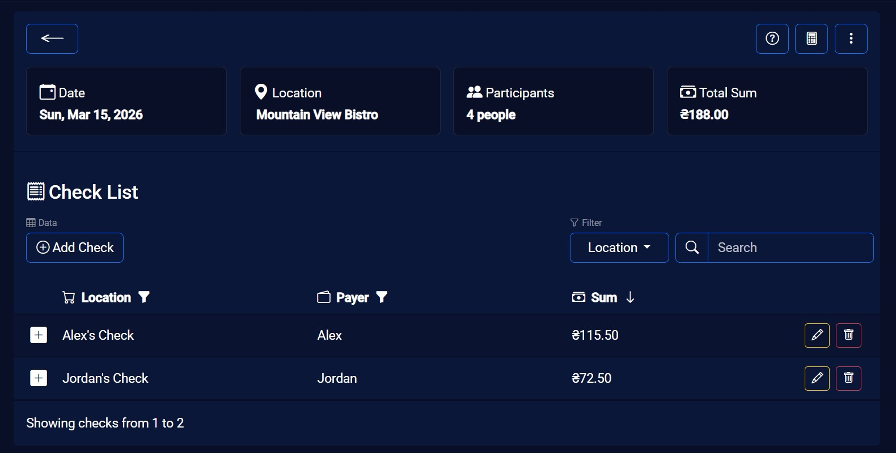
*Managing checks grouped by payer*

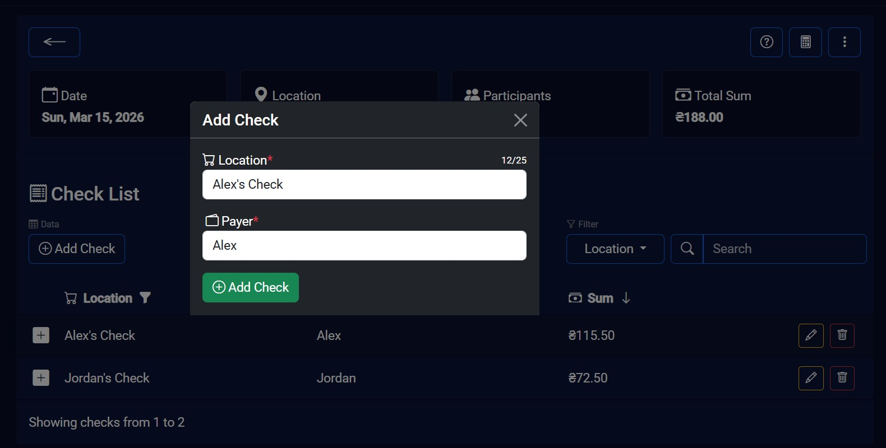
*Creating a new check*

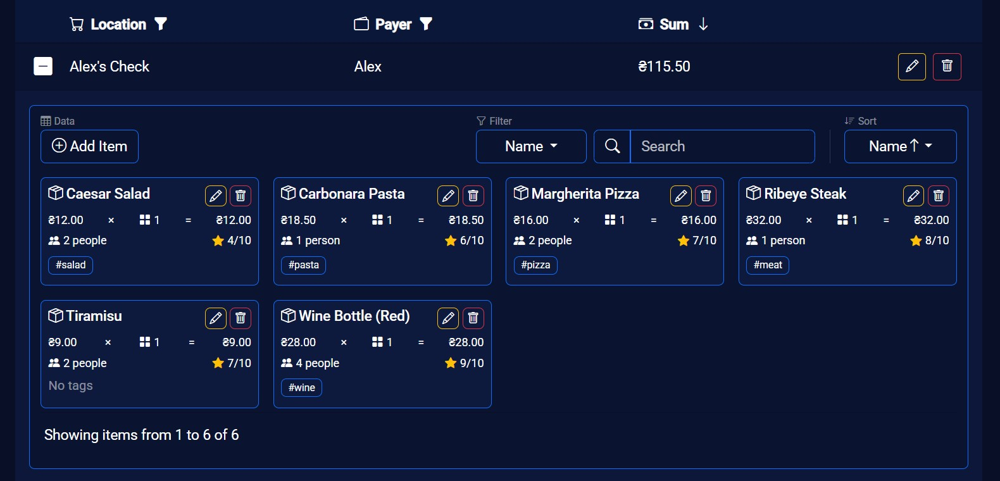
*Individual items within a check*

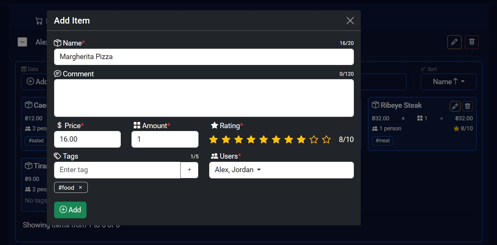
*Adding items with participant selection*

### Calculations
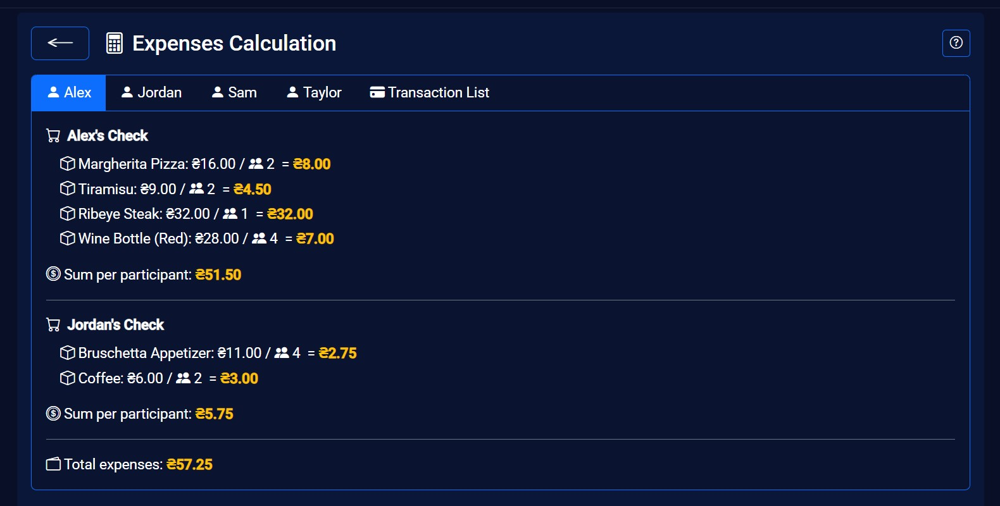
*Individual participant spending overview*

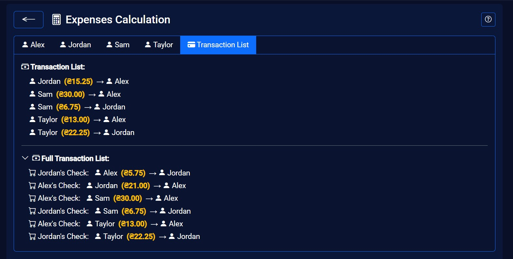
*Settlement transactions showing who owes whom*

### Smart Features
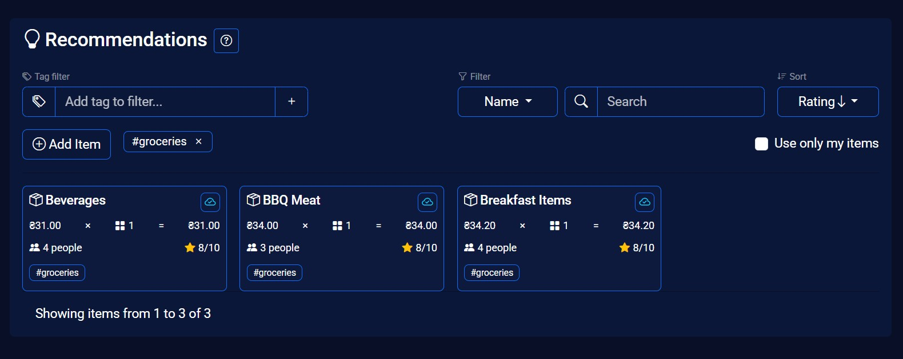
*Smart item discovery and recommendations based on expense history*

## Usage

### Quick Start Guide

1. **Navigate to Expenses List** - Select the "My expenses list" tab to view all your expense groups

2. **Create New Expense** - Click "Add expenses" and enter basic information (name, date, participants)

3. **Manage Checks** - Click the list icon to organize items into checks (receipts)
   - Add checks to group items by who paid for them
   - Each check represents one person's payment

4. **Add Items** - Open each check and add individual items with:
   - Item name and price
   - Participants who consumed each item
   - Quantities if needed

5. **Edit as Needed** - Use edit and delete buttons to correct any mistakes

6. **Calculate** - Click the calculator icon to process all expenses

7. **View Results** - Switch between tabs to see:
   - **Participant Tab**: Total spending per person
   - **Transaction List Tab**: Who owes whom and how much

The app automatically calculates the minimum number of transactions needed to settle all debts fairly.

## Built With

**Frontend:**
* [![Angular][Angular.io]][Angular-url]
* [![TypeScript][TypeScript.org]][TypeScript-url]
* [![Bootstrap][Bootstrap.com]][Bootstrap-url]
* [![RxJS][RxJS.dev]][RxJS-url]

**Backend:**
* [![.NET][Dotnet.com]][Dotnet-url]
* [![C Sharp][CSharp.com]][CSharp-url]

## Roadmap
- [x] Add a manager for adding, editing, deleting items
- [x] Add an expenses calculator
- [x] Add instructions for using the website
- [x] Multi-language support
   - [x] English
   - [x] Ukrainian
- [x] Add participant management system
- [x] Implement tag system for expense categorization
- [x] Add item discovery and recommendations
- [x] Build transaction calculation algorithm
- [ ] Add expenses statistics (average participants, money spent by party, money spent per month, etc.)
- [ ] Add a preview of the check photo
- [ ] Improve the user data access model
- [ ] Add export functionality (PDF, CSV)
- [ ] Implement expense templates for recurring events
- [ ] Add receipt photo upload and OCR scanning

<!-- MARKDOWN LINKS & IMAGES -->
[Angular.io]: https://img.shields.io/badge/Angular-DD0031?style=for-the-badge&logo=angular&logoColor=white
[Angular-url]: https://angular.io
[TypeScript.org]: https://img.shields.io/badge/TypeScript-007ACC?style=for-the-badge&logo=typescript&logoColor=white
[TypeScript-url]: https://www.typescriptlang.org
[Bootstrap.com]: https://img.shields.io/badge/Bootstrap-563D7C?style=for-the-badge&logo=bootstrap&logoColor=white
[Bootstrap-url]: https://getbootstrap.com
[RxJS.dev]: https://img.shields.io/badge/RxJS-B7178C?style=for-the-badge&logo=reactivex&logoColor=white
[RxJS-url]: https://rxjs.dev
[Dotnet.com]: https://img.shields.io/badge/.NET-512BD4?style=for-the-badge&logo=dotnet&logoColor=white
[Dotnet-url]: https://dotnet.microsoft.com
[CSharp.com]: https://img.shields.io/badge/C%23-239120?style=for-the-badge&logo=csharp&logoColor=white
[CSharp-url]: https://docs.microsoft.com/en-us/dotnet/csharp
